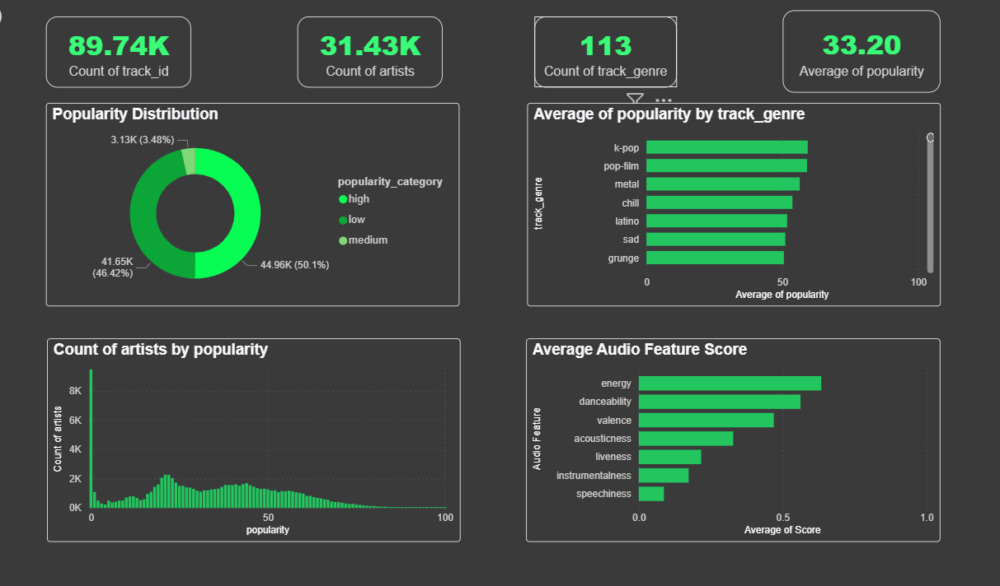
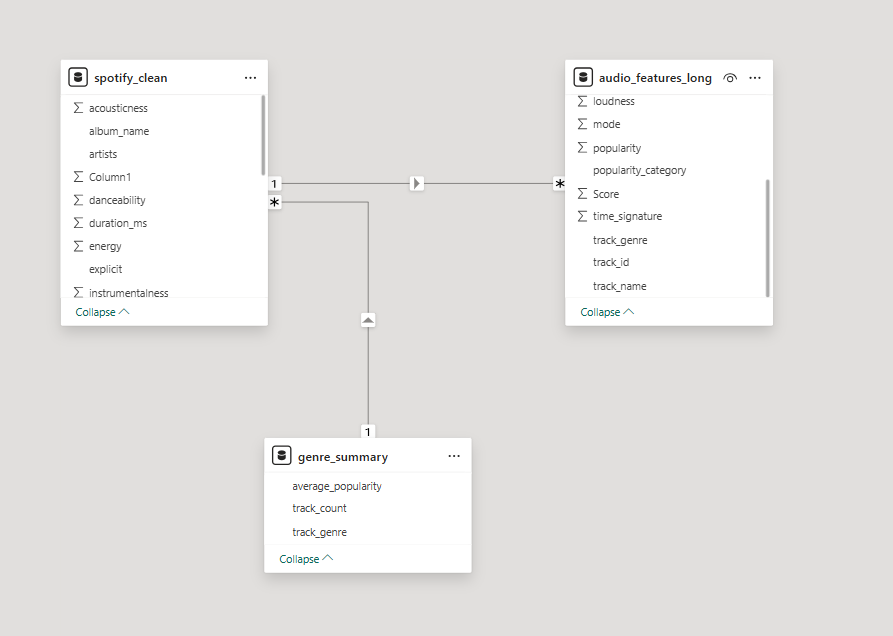
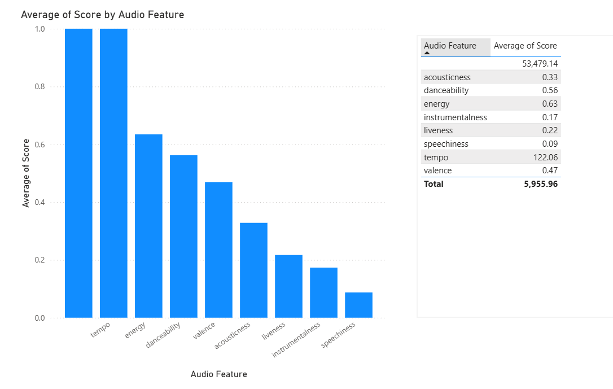
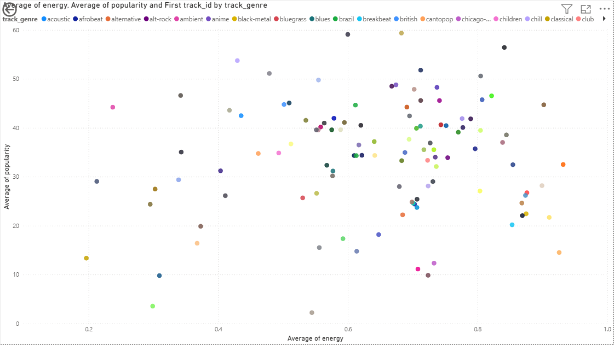
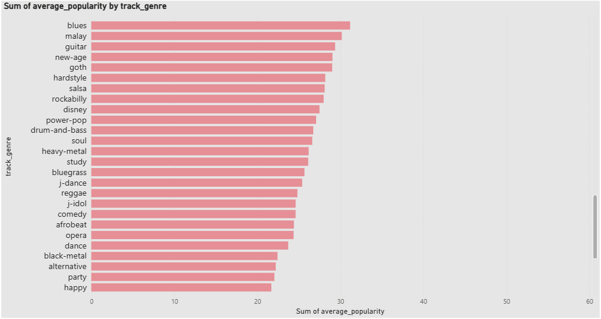
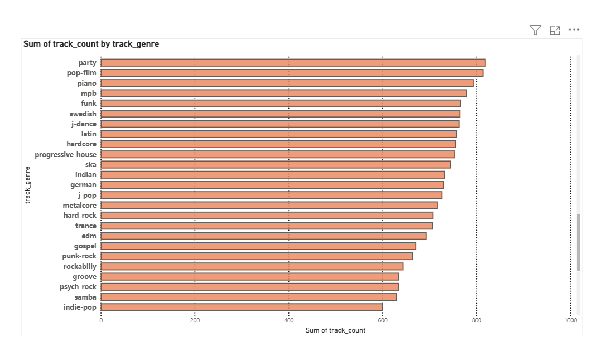

<div align="center">

# 🎧 Spotify Power BI Analytics

### Turning 114K raw, duplicated Spotify tracks into a clean semantic model, a full DAX measure layer, and an interactive dark-theme dashboard.

[](https://powerbi.microsoft.com/)
[](power-query/transformations.md)
[](dax/measures.md)
[](data/raw/spotify.csv)
[](dashboard/)
[](https://github.com/panteamkhh/spotify-powerbi-analytics)

<br>

<a href="dashboard/spotify-dashboard.pbix">
  
</a>

**⬆️ Executive dashboard — KPI row + popularity & genre breakdown. [Open the full report ↗](dashboard/spotify-dashboard.pbix)**

</div>

---

## 📌 Overview

An end-to-end **Power BI analytics project** built on a public Spotify tracks dataset (**114,000 rows × 21 columns**) — taken from raw, heavily-duplicated data all the way through to a modeled semantic layer and a business-ready dashboard.

Unlike a "charts-only" portfolio piece, this project deliberately covers the entire analytics workflow: **profiling → cleaning → reshaping → modeling → DAX → visualization → storytelling**. Roughly **21% of the raw rows were duplicates** and had to be resolved before any number could be trusted.

<div align="center">

| 89.74K | 31.43K | 113 | 33.20 |
|:---:|:---:|:---:|:---:|
| **Total Tracks** | **Total Artists** | **Total Genres** | **Avg. Popularity** |

</div>

---

## 📊 Dashboard Gallery

<div align="center">

### Semantic Model (Star-schema inspired)


</div>

<table>
<tr>
<td width="50%"><br><div align="center"><sub><b>Audio feature profile</b></sub></div></td>
<td width="50%"><br><div align="center"><sub><b>Energy vs. popularity</b></sub></div></td>
</tr>
<tr>
<td width="50%"><br><div align="center"><sub><b>Genre performance</b></sub></div></td>
<td width="50%"><br><div align="center"><sub><b>Catalog depth by genre</b></sub></div></td>
</tr>
</table>

---

## ✨ Highlights

- 🧹 **Deduplication that mattered** — a composite key (`artists` + `track_name` + `album_name`) removed **24,039 duplicate rows**, shrinking the catalog from 114,000 → ~89,961 tracks.
- 🏗️ **Real semantic model** — three tables kept at their natural grain and joined through relationships, not flattened Power Query merges (no row-duplication blow-up).
- 🧮 **DAX measure layer** — a full library of filter-context-aware measures ([`dax/measures.md`](dax/measures.md)), going beyond one-time Power Query aggregations.
- 🎨 **Designed dashboard** — dark theme, Spotify-green accent, KPI-first layout, and cross-filtering across all seven visuals.
- 📝 **Documented decisions** — every transformation, design choice, and trade-off is written down, including *why* Merge/Append were set aside.

---

## 🧭 Project Roadmap (5 Phases)

| Phase | Focus | Documentation |
|---|---|---|
| 🟢 **1 · Data Understanding** | Structure review, data-type validation, profiling, duplicate detection | [`power-query/transformations.md`](power-query/transformations.md) |
| 🟡 **2 · Cleaning & Feature Engineering** | Deduplication, `popularity_category`, Group By, Unpivot to long format | [`power-query/transformations.md`](power-query/transformations.md) |
| 🔵 **3 · Data Modeling** | Star-schema-inspired model, one-to-many relationships, grain separation | [`report.md`](report.md) |
| 🟣 **4 · Dashboard Development** | 4 KPI cards, 7 business visuals, consistent dark theme | [`dashboard/dashboard-notes.md`](dashboard/dashboard-notes.md) |
| 🟠 **5 · Insights & Storytelling** | Findings translated into plain-language business insights | [`report.md`](report.md) |

**Phase 3 deep-dive — relationships vs. flattening:**

- [`power-query/merge-demo.md`](power-query/merge-demo.md) — Merge Queries walkthrough (evaluated, **not** applied)
- [`power-query/append-demo.md`](power-query/append-demo.md) — Append Queries walkthrough (evaluated, **not** applied)

---

## 🧮 DAX Measure Layer

The model ships with a **paste-ready DAX library** in [`dax/measures.md`](dax/measures.md), organized into six folders. A few examples:

```dax
Total Tracks = COUNTROWS ( spotify_clean )

Average Popularity = AVERAGE ( spotify_clean[popularity] )
```

```dax
Genre Rank by Popularity =
RANKX ( ALL ( spotify_clean[track_genre] ), [Average Popularity], , DESC, DENSE )
```

```dax
Genre Insight =
VAR CurrentGenre = SELECTEDVALUE ( spotify_clean[track_genre] )
VAR GenreAvg = [Average Popularity]
VAR CatalogAvg =
    CALCULATE ( [Average Popularity], ALL ( spotify_clean[track_genre] ) )
RETURN
    IF (
        ISBLANK ( CurrentGenre ),
        "Select a genre to see its performance against the catalog average.",
        CurrentGenre & " averages " & FORMAT ( GenreAvg, "0.0" )
            & " popularity — "
            & IF ( GenreAvg >= CatalogAvg, "above", "below" )
            & " the catalog average of " & FORMAT ( CatalogAvg, "0.0" ) & "."
    )
```

**What's inside:** core KPIs · popularity distributions · genre ranking & dynamic labels · per-feature audio measures · filter-aware UX measures · Top-N helpers, plus suggested format strings.

> **Note:** the measures are documented as the model's explicit DAX layer and can be pasted into Power BI Desktop in a few minutes (instructions at the top of the file). The published `.pbix` currently relies on the implicit Power Query aggregations captured in the screenshots above.

---

## 📁 Repository Structure

```text
spotify-powerbi-analytics/
│
├── data/
│   ├── README.md                    # Dataset dictionary (21 columns)
│   └── raw/
│       └── spotify.csv              # 114,000 × 21 source dataset
│
├── power-query/
│   ├── transformations.md           # Full cleaning & reshaping log
│   ├── merge-demo.md                # Merge Queries — evaluated, not applied
│   └── append-demo.md               # Append Queries — evaluated, not applied
│
├── dax/
│   └── measures.md                  # Paste-ready DAX measure library
│
├── dashboard/
│   ├── spotify-dashboard.pbix       # Power BI report file
│   ├── dashboard-notes.md           # Design rationale per visual
│   └── screenshots/                 # Exported page & visual views
│
├── CHANGELOG.md                     # Project history
├── LICENSE                          # MIT
├── report.md                        # Full analytics case-study report
└── README.md
```

---

## 🛠️ Tech Stack

| Layer | Tool |
|---|---|
| BI & Visualization | Power BI Desktop |
| Data Transformation | Power Query (M Language) |
| Semantics | DAX |
| Source Data | CSV (Spotify Tracks dataset) |
| Version Control | Git & GitHub |

---

## 🚀 Getting Started

1. **Clone the repository**
   ```bash
   git clone https://github.com/panteamkhh/spotify-powerbi-analytics.git
   ```
2. **Open the report** — launch `dashboard/spotify-dashboard.pbix` in [Power BI Desktop](https://powerbi.microsoft.com/desktop/).
3. **Explore the model** — switch to *Model view* to see the two one-to-many relationships.
4. **Activate the DAX layer** — paste the measures from [`dax/measures.md`](dax/measures.md) via *Modeling → New measure*.
5. **Read the story** — start with [`report.md`](report.md) for the full findings.

---

## 💡 Key Insights

- **Popularity is long-tailed, not evenly spread** — a mean of **33.2** against a 0–100 scale means most tracks sit well below the midpoint.
- **Genre is a real differentiator** — genre averages split persistently above and below the catalog-wide mean, making genre the best first filter.
- **Audio-feature profiles cluster by genre** — the unpivoted long table lets all eight features be compared across genres in a single matrix.
- **No single audio feature explains popularity** — the scatter plot shows loose, non-linear tendencies at best, pointing to drivers outside this dataset (artist reach, playlist placement, release timing).
- **Deduplication changed the numbers that matter** — 21% of raw rows were duplicates; any pre-clean KPI would have overstated the catalog.

Full analysis in [`report.md`](report.md) → [Section 5](report.md#5-key-findings).

---

## 📚 Documentation Index

| Document | What it covers |
|---|---|
| [`report.md`](report.md) | Full case study: methodology, findings, limitations |
| [`data/README.md`](data/README.md) | Dataset dictionary — all 21 columns, grain and caveats |
| [`power-query/transformations.md`](power-query/transformations.md) | Step-by-step Power Query log |
| [`power-query/merge-demo.md`](power-query/merge-demo.md) | Merge Queries technique reference |
| [`power-query/append-demo.md`](power-query/append-demo.md) | Append Queries technique reference |
| [`dax/measures.md`](dax/measures.md) | DAX measure library |
| [`dashboard/dashboard-notes.md`](dashboard/dashboard-notes.md) | Visual-by-visual design rationale |
| [`CHANGELOG.md`](CHANGELOG.md) | Project history |

---

## 🙌 Acknowledgements

- Dataset: public **Spotify Tracks Dataset** (Kaggle) — 114,000 tracks.
- Chart design inspired by the Spotify brand palette.

---

## 📄 License

Released under the [MIT License](LICENSE) © 2026 Panteamkhh.

---

<div align="center">

**Built by [panteamkhh](https://github.com/panteamkhh)** · If you found this project useful, consider giving it a ⭐

</div>
